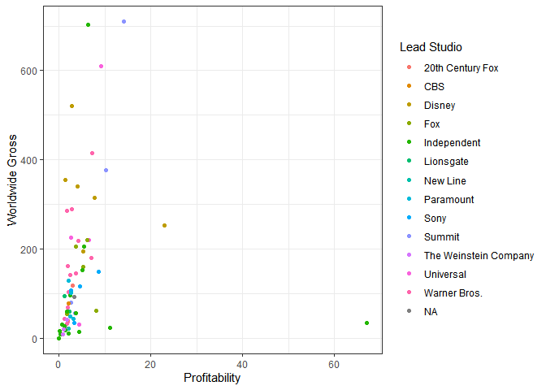
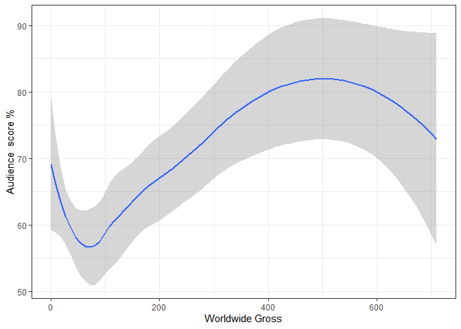

## This is the Readme for the assignment for Nico to mark

# Question 1

I make sure my code is sourced

    library(tidyverse)

    ## Warning: package 'tidyverse' was built under R version 4.0.4

    ## -- Attaching packages --------------------------------------- tidyverse 1.3.0 --

    ## v ggplot2 3.3.3     v purrr   0.3.4
    ## v tibble  3.1.0     v dplyr   1.0.4
    ## v tidyr   1.1.3     v stringr 1.4.0
    ## v readr   1.4.0     v forcats 0.5.1

    ## Warning: package 'ggplot2' was built under R version 4.0.4

    ## Warning: package 'readr' was built under R version 4.0.4

    ## Warning: package 'purrr' was built under R version 4.0.4

    ## Warning: package 'dplyr' was built under R version 4.0.4

    ## Warning: package 'stringr' was built under R version 4.0.4

    ## Warning: package 'forcats' was built under R version 4.0.4

    ## -- Conflicts ------------------------------------------ tidyverse_conflicts() --
    ## x dplyr::filter() masks stats::filter()
    ## x dplyr::lag()    masks stats::lag()

    list.files('Code/Q1/', full.names = T, recursive = T) %>% as.list() %>% walk(~source(.))

I read the data in

    Movies<-Read1("C:/Users/Jamie/Documents/R/Datascience/19818157/Data/Practical/Movies/Movies.csv")

And do some analytics to show my friend what the data says on her
points. Below shows a table of all the films that Rotten tomatoes scored
over 80%, only two have audience scores over 85% proving my friend
wrong.

    Ratings_comparison_table()

    ## Warning: package 'huxtable' was built under R version 4.0.4

    ## 
    ## Attaching package: 'huxtable'

    ## The following object is masked from 'package:dplyr':
    ## 
    ##     add_rownames

    ## The following object is masked from 'package:ggplot2':
    ## 
    ##     theme_grey

    ##          Film                      Audience score %   Rotten Tomatoes %  
    ##          (500) Days of Summer                    81                  87  
    ##          A Serious Man                           64                  89  
    ##          Beginners                               80                  84  
    ##          Enchanted                               80                  93  
    ##          Jane Eyre                               77                  85  
    ##          Knocked Up                              83                  91  
    ##          Midnight in Paris                       84                  93  
    ##          My Week with Marilyn                    84                  83  
    ##          Rachel Getting Married                  61                  85  
    ##          Tangled                                 88                  89  
    ##          Waitress                                67                  89  
    ##          WALL-E                                  89                  96  
    ## 
    ## Column names: Film, Audience score %, Rotten Tomatoes %

Also on the note of Disney being the most profitable the graph below
shows this is not necessarily so

    plot1.2()

    ## Warning: Removed 3 rows containing missing values (geom_point).

 As for
correlation between World wide Gross an Audience score the important
thing to note is that the relationship changes from negative to positive
and back to negative, and therefore there is no clear correlation over
all movies that one can make without putting the grossing into segments

    Regression_Plot(Movies)

    ## `geom_smooth()` using method = 'loess' and formula 'y ~ x'

    ## Warning: Removed 1 rows containing non-finite values (stat_smooth).

# Question 2

I make sure my code is sourced

    library(tidyverse)
    list.files('Code/Q2/', full.names = T, recursive = T) %>% as.list() %>% walk(~source(.))

Unfortunately time did not allow me to put attention to this dataset

I moved onto to question three as it was emphasised as important and the
dataset was highly interesting and relevant \# Question 3

I make sure my code is sourced

    library(tidyverse)
    list.files('Code/Q3/', full.names = T, recursive = T) %>% as.list() %>% walk(~source(.))

Since I require a formal Texevier document I load the template into my
settings folder to be able to copy

I can now edit the template to discuss and present my findings as the
pdf output will show.

I read in and join the data
